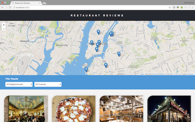
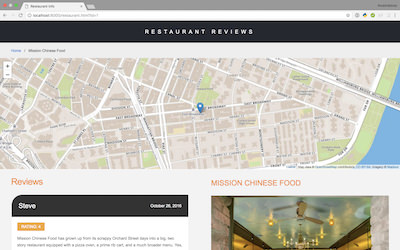
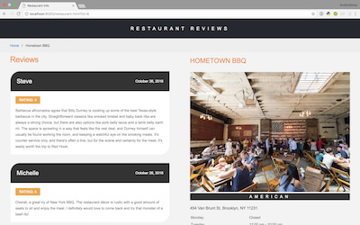

# Restaurants Reviews

I created this website for the purposes of the [Udacity's Front-End Web Developer Nanodegree Program](https://www.udacity.com/course/front-end-web-developer-nanodegree--nd001) to showcase my skills in:

- Responsive design (CSS Grid Layout, Media Queries)
- Accessibility (WCAG 2.0, WAI-ARIA)
- Service Workers

## How to Load the Website

- Clone the **[repo](https://github.com/anastasioscho/udacity-restaurant-reviews.git)**.
- In a terminal, cd into the project directory.
- If you have Python 2.x, spin up the server with `python -m SimpleHTTPServer 8000` (or some other port, if port 8000 is already in use). For Python 3.x, you can use `python3 -m http.server 8000`. If you don't have Python installed, navigate to Python's [website](https://www.python.org/) to download and install the software.
- Visit the site http://localhost:8000.

## Screenshots

  

## Leaflet.js and Mapbox:

This repository uses [leafletjs](https://leafletjs.com/) with [Mapbox](https://www.mapbox.com/). You need to replace `<your MAPBOX API KEY HERE>` with a token from [Mapbox](https://www.mapbox.com/). Mapbox is free to use, and does not require any payment information.